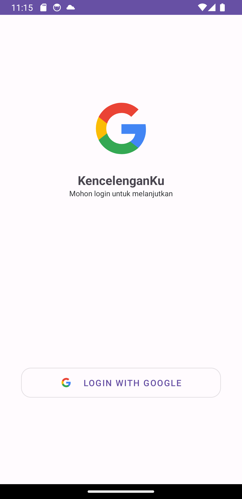
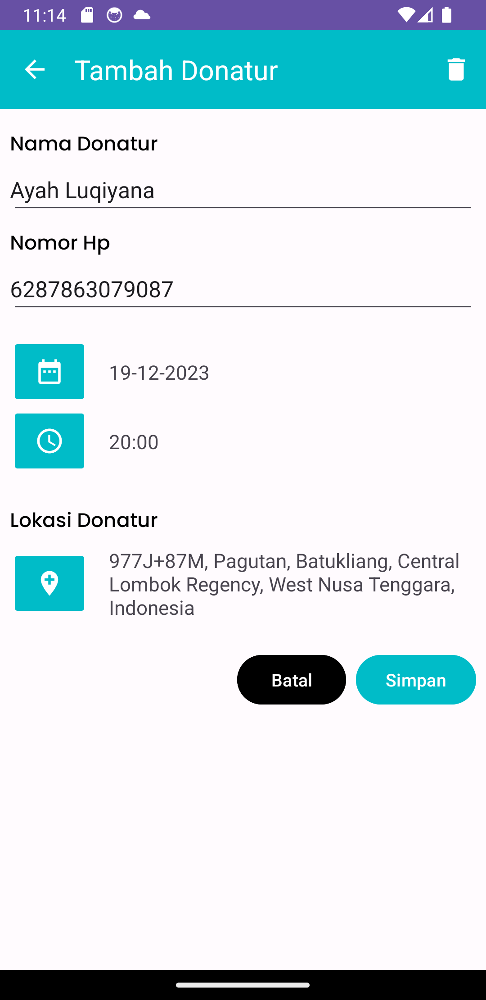
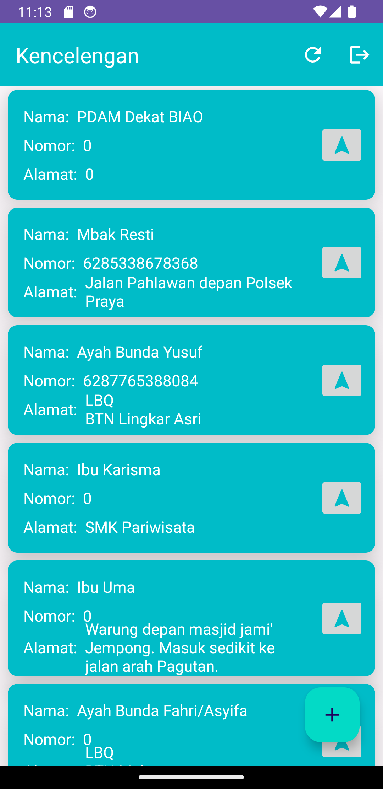

 

<h1 align = "center">
<b><i>Kencelengan App</i></b>
</h1>
  

 

# :demo: **Screenshots** :demo:  
[Screenshots](#camera_flash-screenshots-camera_flash) ~
[Deployment](#arrow_lower_right-deployment-arrow_lower_right) ~
[Architecture](#hammer_and_wrench-architecture-hammer_and_wrench) ~
[Tech Stack](#building_construction-tech-stack-building_construction) ~
[Authors](#memo-authors-memo) 
 

    
KencelenganApp allows foundation institutions to write and save data entries with the option to include address and coordinate location where kencelengan entrusted. 

KencelenganApp is a complete charity project written in Kotlin and powered by Android Jetpack. It is a Single Module Project. The Data part is handled by a Firebase and Location coordinate with Google Map Api.

# :camera_flash: **Screenshots** :camera_flash:

KencelenganApp follows the latest Material 3 guidelines for a visually appealing and a consistent UI.

 &nbsp;&nbsp;&nbsp;&nbsp;
 &nbsp;&nbsp;&nbsp;&nbsp;   
 &nbsp;&nbsp;&nbsp;&nbsp; 

# :arrow_lower_right: Deployment :arrow_lower_right:
These are the key parameters for KencelenganApp.

| Parameters     | Value |
|----------------|-------|
| compileSdk     | 34    |
| targetSdk      | 34    |
| minSdk         | 26    |
| kotlinVersion  | 1.9.0 |

You can clone the repository or download the Zip file [here](https://github.com/setiawanboedy/kencelengan)

To build and run the app, you will need the latest version of Android Studio Koala (or [newer](https://developer.android.com/studio/)) installed on your system.
# :hammer_and_wrench: Architecture :hammer_and_wrench:
### Modules

KencelenganApp is initially built using Android Clean Architecture that follows the more familiar   **Model-View-ViewModel** (MVVM) pattern.

### Navigation
The app has :three: screen destinations.

| :feature:auth                       | :feature:home                       | :feature:write                      |
|-------------------------------------|-------------------------------------|-------------------------------------|
| [Auth](#demo-screenshots-demo)       | [Home](#demo-screenshots-demo)     | [Write](#demo-screenshots-demo)     |

- **Authentication Feature**: This feature focuses on user authentication and validation. It utilizes Google Sign-In to ensure that users can securely access their data entries.

- **Home Feature**: The Home feature is responsible for displaying and filtering data entries based on near location. It provides a user-friendly interface to navigate through data entries and quickly filter diaries by nearest location. Additional select navigation icon in item can open map and navigate to data location of kencelengan.

- **Write Feature**: The Write feature enables users to create new data entries or modify existing ones. It offers a seamless and intuitive interface for users to capture data of memeber kencelengan. KencelenganApp empowers the users to save location where kencelengan entrusted.

# :building_construction: Tech Stack :building_construction:

The KencelenganApp project uses many popular libraries and tools in the Android Ecosystem:

* [Android Jetpack](https://developer.android.com/jetpack) - Jetpack encompasses a collection of Android libraries.
* [Android KTX](https://developer.android.com/kotlin/ktx) - helps to write more concise, idiomatic Kotlin code.

* [Coroutines and Kotlin Flow](https://kotlinlang.org/docs/reference/coroutines-overview.html) - used to manage the local storage i.e. `writing to and reading from the database`. Coroutines help in managing background threads and reduces the need for callbacks.
* [Material Design 3](https://m3.material.io/) - an adaptable system of guidelines, components, and tools that support the best practices of user interface design.
* [Google Accompanist Libraries](https://github.com/google/accompanist) - these are a collection of extension libraries for Jetpack Compose. DiaryApp specifically uses Accompanist's Pager Library
* [Dagger Hilt](https://dagger.dev/hilt/) - used for Dependency Injection.

* [Firebase Firestore](https://firebase.google.com/docs/firestore/android/start) -  Firebase Firestore is a scalable and reliable database solution used in the app for storing and retrieving data entries.
* [Firebase Auth](https://firebase.google.com/docs/auth/android/start) - Firebase Authentication provides a secure and easy-to-use authentication system, allowing users to sign in and access their diary entries securely.
* [Timber Logging](https://github.com/JakeWharton/timber) - Timber is a logger with a small, extensible API which provides utility on top of Android's normal Log class..

* [Google MAPS](https://developers.google.com/maps/documentation/android-sdk/start) - Create an Android app that displays a map by using the Google Maps Views template for Android.

# :memo: Authors :memo:
- [@setiawanboedy](https://github.com/setiawanboedy)
